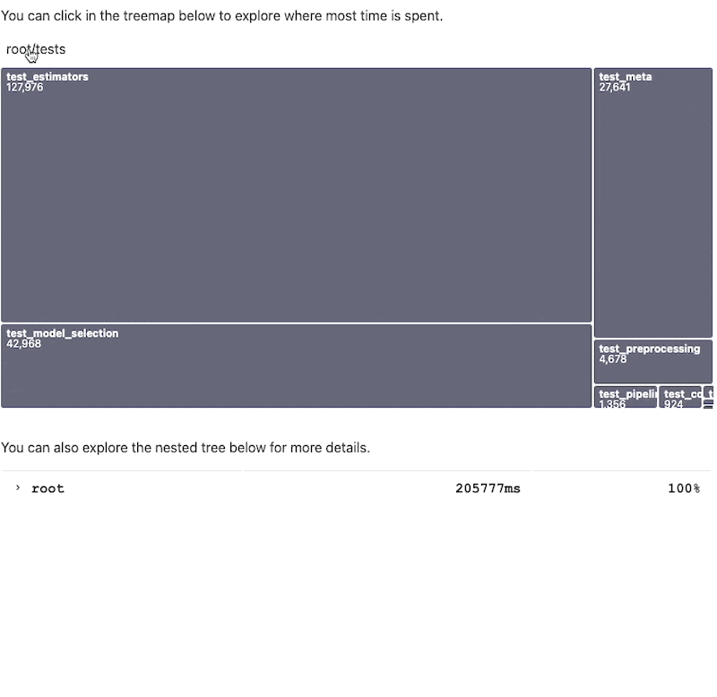

# Pytest Duration Insights 


This python package offers a small dashboard that helps you investigate
long running pytest runs. It's built on top of the report that is generated 
by [pytest-reportlog](https://github.com/pytest-dev/pytest-reportlog). 

## Preview 

We're hosting a demo on GitHub pages. You can view it 
[here](https://koaning.github.io/pytest-duration-insights/). There's also an educational
video announcement on [calmcode.io](https://calmcode.io) found [here](https://calmcode.io/labs/pytest-duration-insights.html).



## Instructions. 

### 1. Install.

```
pip install pytest-reportlog pytest-duration-insights
```

### 2. Make a report. 

```
pytest --report-log reportlog.jsonl
```

### 3. Explore!

```
pytest-duration-insights explore reportlog.jsonl
```

This will start up a service that tries to help you find areas in your
testing code base that are worth investigating.

#### Parametrized Tests 

This tool automatically hides the parametrized test results. But if these 
are very important to you then you can turn them on via the `--no-trim` flag.

```
pytest-duration-insights explore --no-trim reportlog.jsonl
```

Be aware that you might get very dense visuals when you do this.


## Roadmap 

We're only scratching the surface of what data we can visualise to help 
you speed up your `pytest` runs. Feedback is appreciated, 
especially if somebody has a keen insight that has helped in the past.

That said, this project is very much an experiment as well. See it as a tool you could
try rather than a best practice.
